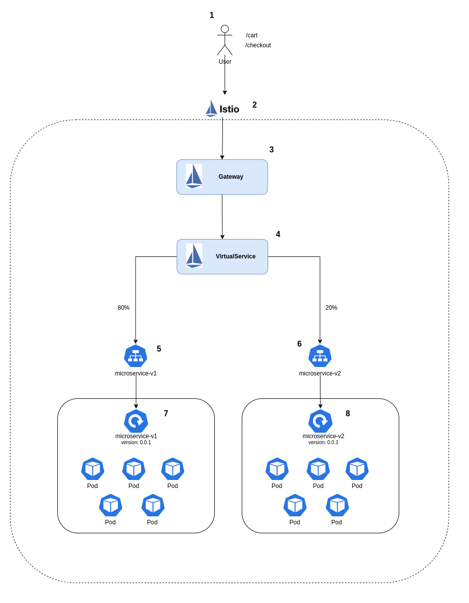

# Hash Teste SRE - Solução

<br/>

# Arquitetura

## 1. Desenho de Arquitetura

<br/>

1. Usuário que não poderá ser impactado chamando os paths /cart e /checkout que serão migrados para o novo micro serviço;
2. Istio - Ferramenta responsável por cuidar de toda malha de serviço e nos possibilitará fazer o canary para os 2 serviços sem impacto para o usuário;
3. Gateway (Componente do Istio) - É onde será feito as configurações de entrada do Istio Gateway (80 no nosso estudo de caso) e para qual porta será redirecionado as chamadas (8080 no nosso estudo de caso) que chegarem na porta de entrada;
4. VirtualService (Componente do Istio) - As configurações de quais paths serão chamados (Ex. /cart e /checkout), para qual service do kubernetes serão redirecionados e qual o peso de cada microserviço fica neste arquivo de configuração;
5. Service Kubernetes do Microserviço v1 (legado) - responsável por expor o deployment do microserviço v1;
6. Service Kubernetes do Microserviço v2 (novo)   - responsável por expor o deployment do microserviço v2;
7. Deployment Kubernetes do Microserviço v1 (legado) - onde ficam todas as configurações de quantidade de replicas, imagem do container, tag, health check da aplicação v1;
8. Deployment Kubernetes do Microserviço v2 (novo) - onde ficam todas as configurações de quantidade de replicas, imagem do container, tag, health check da aplicação v2;

<br/>



<br/>

## Estratégia de Rollout

Aplicaremos a estratégia de rollout para todo namespace v2 do microserviço gradativamente via istio, utilizando o weight (peso) existente no virtual service. Até que os usuários estejam todos redirecionados nos paths /cart e /checkout para o microserviço v2, faremos um acompanhamento para verificar se os usuários não estão sendo impactados, se isso ocorrer, é só voltar o peso todo para a versão v1 que ja existe hoje em produção.

## Pré-requisitos
- Cluster GKE provisionado;
- Cluster limpo de qualquer instalação do istio, independente da versão;
- Estar logado como administrador no cluster do Kubernetes;
- Client (istioctl) e pacote de instação do istio na versão 1.8.1;
- kubectl em uma versão atualizada;

## Etapas para provisionamento das aplicações de teste
<br/>

### Criando os namespaces e injetando o istio label:
```bash
kubectl create namespace v1 && kubectl create namespace v2

kubectl label namespace v1 istio-injection=enabled && kubectl label namespace v2 istio-injection=enabled
```

<br/>

### Instalando as dependências de Chart localmente
```bash
helm dependency update ./helm/Charts/app/
```
<br/>

### Instalando a aplicação v1 (legada) via helm
```bash
helm upgrade --install microservice-v1 ./helm/Charts/app/ --wait --set image=lucasnp1990/microservice-hash --set version=v1-0.0.1 --namespace v1 --create-namespace --wait --debug
```

<br/>

### Testando a aplicação instalada
```bash
# passando o path que quero testar por parâmetro para o script (Ex. cart ou checkout)
./test.sh cart
```

<br/>

### Instalando a aplicação v2 (aplicação que será utilizada posteriormente ao rollout) via helm e liberando 10% do trafego
```bash
helm upgrade --install microservice-v2 ./helm/Charts/app/ --wait --set image=lucasnp1990/microservice-hash --set version=v2-0.0.1 --set istio.v1Weight=90 --set istio.v2Weight=10 --namespace v2 --create-namespace --wait --debug
```

## 2. Multi-Tenancy

A multilocação no Kubernetes significa que um cluster e seu plano de controle são compartilhados por vários usuários, cargas de trabalho ou aplicativos. É o oposto da locação única, em que apenas um usuário usa um cluster Kubernetes inteiro. Existem diferentes tipos de multilocação, multilocação flexível, e multilocação rígida são algumas delas.

## Algumas boas práticas de Multi-Tenancy em um cluster Kubernetes

1. Configurar o acesso do namespace de cada aplicação somente para aqueles pods que realmente necessitam de acesso;
2. Criar RBAC para Admin, Administrador de Namespace e Desenvolvedor para cada uma das namespaces;
3. Configurar PodSecurityPolicy para não ser possível executar no pod comandos com privilégio sudo;


# Desenvolvimento